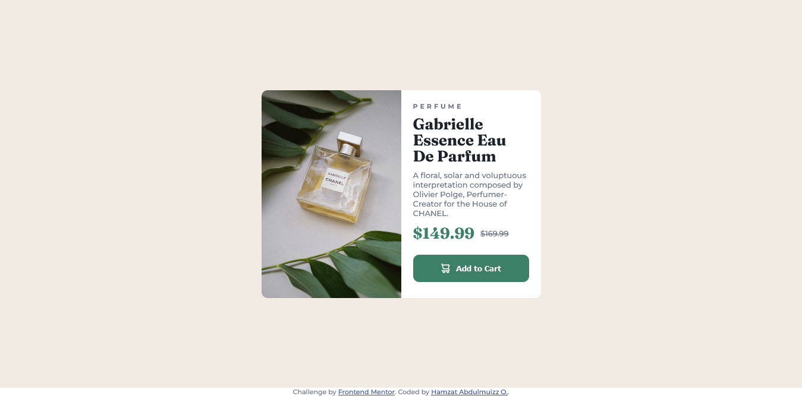

# Frontend Mentor - Product preview card component solution

This is a solution I came up with for the  [Product preview card component challenge on Frontend Mentor](https://www.frontendmentor.io/challenges/product-preview-card-component-GO7UmttRfa). Frontend Mentor challenges help you improve your coding skills by building realistic projects. 

## Table of contents

- [Overview](#overview)
  - [The challenge](#the-challenge)
  - [Screenshot](#screenshot)
  - [Links](#links)
- [My process](#my-process)
  - [Built with](#built-with)
  - [What I learned](#what-i-learned)
  - [Continued development](#continued-development)
- [Author](#author)

## Overview
A project primarily on implementing a product preview card component that carries the image of the product, name, category, prices and discounted prices. It also features an interactive call to action button to add the product to cart. A component that can be used in an e-commerce project.
### The challenge

Users should be able to:

- View the optimal layout depending on their device's screen size
- See hover and focus states for interactive elements

### Screenshot

### Links

- Solution URL: [github](https://github.com/Abdulmuizz98/project-preview-card-component)
- Live Site URL: [here](https://abdulmuizz98.github.io/project-preview-card-component)

## My process

### Built with

- Semantic HTML5 markup
- CSS custom properties
- Flexbox
- CSS Grid
- Mobile-first workflow

### What I learned

I learnt to approach my builds from a mobile first point of view, so I was able to transition the mobile view into a tablet and a desktop view, thereby reinforcing my
knowledge of "Responsive Designs". 

I also played around with using the flex and grid layouts, most importantly playing with their easily center div features.

Going into the project I worked on time management and discipline by trying to time myself on some components and also making sure I was done with a section before moving over to another chunk of the project.

### Continued development

Going forward, I would be focusing on honing my animation skills with css while trying to implement some more advanced strategies, like working on drop downs and making them responsive. Although, this would mean employing more javascript code.

## Author

- Frontend Mentor - [@Abdulmuizz98](https://www.frontendmentor.io/profile/Abdulmuizz98)
- Twitter - [@AbdulmuizzHamz1](https://www.twitter.com/AbdulmuizzHamz1)

